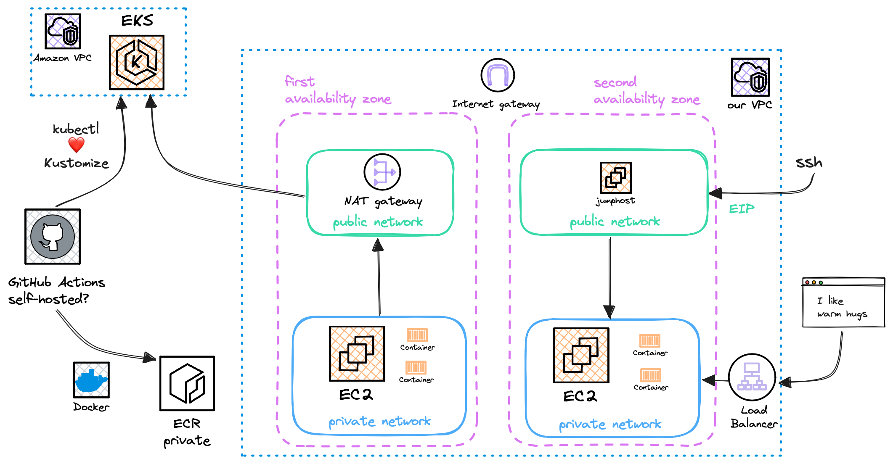

Hi there 🙌

The solution to the task of deploying an application in Kubernetes using AWS infrastructure is described in the following sections. We'll start with navigating the project's structure, then mention the application's characteristics, how the AWS infrastructure looks like and do a walk-through of the application's deployment. Next, the usage guidelines are described, followed by the requested open discussion points.

#### 📚 References
* Git repository - https://github.com/nskalis/assignment-z.git

## 🧬 Project structure

The directories hierarchy looks like this:
```
.
├── .github
│   └── workflows
├── application
│   └── hug
│       └── go
├── kubernetes
│   └── application
│       └── hug
└── terraform
    ├── environments
    │   └── labs
    └── modules
        ├── eks
        ├── jumphost
        ├── keypair
        └── vpc
```

In the `application` directory is where the web application code resides in. The `kubernetes` directory includes the manifest files for deploying the web application in Kubernetes. The AWS infrastructure is defined in `terraform` configuration objects. Lastly, in the `.github` directory the workflow for the application deployment is described.


### 🐳 Application

Our web application has been implemented in Go lang, its name is `hug`, listens to port `8000` (http1) by default and is containerised with `docker`. The build instructions are described also in `.github/workflows/hug.yaml`.

```
cd application/hug/go
docker buildx build --tag hug:3.0.1-distroless --file Dockerfile .
slim build --tag=hug:3.0.1-distroless-slim hug:3.0.1-distroless
```

The resulted image size is 8MB.

|  | golang | busybox | distroless | scratch |
|:--|:--|:--|:--|:--|
| hug | 990MB | 12.1MB | 9.85MB | 7.87MB |
| hug.slim | 8.88MB | 7.96MB | 8.08MB | 7.87MB |

In the Kubernetes context; `hug` runs in its own namespace with enforcing pod security admission (PSA), it is scaled to 2 replicas and it is exposed as a service of type `LoadBalancer`. Pods are spread across nodes based on their hostname using `topologySpreadConstraints` (in our example, we deploy 1 node on each availability zone).

#### 📚 References
* ["Distroless" Container Images](https://github.com/GoogleContainerTools/distroless/blob/main/README.md)
* [slimtoolkit](https://github.com/slimtoolkit/slim)
* [Image security](https://aws.github.io/aws-eks-best-practices/security/docs/image/)

### ⚒️ Infrastructure

A picture is worth a thousand words, they say, so let's draw one to depict the AWS resources the solution in question is based upon.



The security-focused design improvements are described later on.

The AWS infrastructure is managed as code with Terraform. The Terraform configuration is based mainly on the following principles:
* Be judicious in our use of variables. Only parameterise values that must vary for each instance or environment.
* Output all useful values that root modules might need to refer to or share.
* Use separate directories for each service. Use environment directories. Put static files in a separate directory.
* Expose labels as a variable.

In an effort to raise the quality of the Terraform code, we leveraged some open source tools, such as `checkov` and `tfsec`.

```
# change directory to "terraform"
terraform fmt --recursive
terraform validate 
tflint
(cd modules && tflint --recursive)
checkov --directory .
tfsec .
```

#### 📚 References
* [Best practices for using Terraform](https://cloud.google.com/docs/terraform/best-practices-for-terraform#variables)
* [Security groups](https://aws.github.io/aws-eks-best-practices/security/docs/network/#security-groups)
* [Amazon EKS security group requirements and considerations](https://docs.aws.amazon.com/eks/latest/userguide/sec-group-reqs.html)
* [Network Connectivity](https://github.com/terraform-aws-modules/terraform-aws-eks/blob/master/docs/network_connectivity.md)

### 🍰 Deployment

The GitHub Actions workflow is defined in `.github/workflows/hug.yaml`. If we propose some changes to the `application/hug/` directory in the `main` branch, then the GitHub Actions workflow will be triggered, click on the Actions tab at the UI of your GitHub repository to see how it is progressing.
The `hug` container image is built, then pushed to a private ECR repository (preferably with container image tag immutability enabled). Kustomize updates the kubernetes manifest files in the `kubernetes/application/hug` directory based on the new container image tag. A placeholder that starts with `kustomize-` (such as `kustomize-container-image-registry`) denotes a field in a Kubernetes manifest that is managed by Kustomize.

#### 📚 References
* [Communication between self-hosted runners and GitHub](https://docs.github.com/en/actions/hosting-your-own-runners/managing-self-hosted-runners/about-self-hosted-runners#communication-between-self-hosted-runners-and-github)

## 👀 Guidelines

The Prerequisites section describes the steps required to setup GitHub Actions and Amazon ECR (if non-existent). They are one-time steps only since the AWS credentials are unique to each audience.

### ✔️ Prerequisites

#### Amazon ECR

```
aws configure
aws ecr create-repository --repository-name hug --region <aws-region>
```

#### GitHub Actions

Setup your git repository: (click on) Settings ‣ Secrets and variables ‣ Actions ‣ (New) Repository secret ‣ Add secret ‣ (fill-in)

| Name | Secret |
|:--|:--|
| `AWS_ACCESS_KEY_ID` | `<some-aws-access-key-id>` |	
| `AWS_SECRET_ACCESS_KEY` | `<some-aws-secret-access-key>` |		

### ⚙️ Input settings

* Review the parameters in `terraform/environments/labs/proj.tfvars`.
* Review the `env` parameters in `.github/workflows/hug.yaml`.

### ⌨️ Usage

* Create the AWS infrastructure:

```
# mark our aws credentials to be passed to child processes
export AWS_ACCESS_KEY_ID="<some-aws-access-key-id>"
export AWS_SECRET_ACCESS_KEY="<some-aws-secret-access-key>"

# change directory to "terraform"
terraform init -reconfigure -var-file=environments/labs/proj.tfvars -backend-config=environments/labs/local.tfbackend

terraform plan -var-file=environments/labs/proj.tfvars
terraform apply -var-file=environments/labs/proj.tfvars 
```

* Propose some changes to `application/hug/` directory in the `main` branch (for example, add a new line in `server.go`). Next, the GitHub Actions workflow will be triggered.

* Let's verify:

```
aws eks update-kubeconfig --name <aws-kube-cluster-name> --region <aws-region>

kubectl -n hug get svc
NAME          TYPE           CLUSTER-IP       EXTERNAL-IP                                                                PORT(S)          AGE
hug-service   LoadBalancer   172.20.115.147   a7ce190b82a084080a60dc46c39c90f8-1208700454.eu-north-1.elb.amazonaws.com   8000:30827/TCP   2m2s

kubectl -n hug get pods -o wide
NAME                              READY   STATUS    RESTARTS   AGE     IP            NODE                                         NOMINATED NODE   READINESS GATES
hug-deployment-58cc9f5f98-l4v6t   1/1     Running   0          2m14s   10.31.2.185   ip-10-31-2-159.eu-north-1.compute.internal   <none>           <none>
hug-deployment-58cc9f5f98-q7bsr   1/1     Running   0          2m14s   10.31.1.72    ip-10-31-1-230.eu-north-1.compute.internal   <none>           <none>
```
```
curl ac8da6da346c84f7385e61b1ec0e1452-473064592.eu-north-1.elb.amazonaws.com:8000
I like warm hugs (3.0.1)
```

* Return to the repository's directory and let's clean-up everything:

```
# change directory to "kubernetes"
kubectl delete application/hug

# OR, adopting a gitops style
# propose some changes to the repository and modify .github/workflows/hug.yaml in the following way

# before
kubectl kustomize application/hug | kubectl apply -f -
# after
kubectl kustomize application/hug | kubectl delete -f -
```

```
# change directory to "terraform"
terraform destroy -var-file=environments/labs/proj.tfvars
```

## 💡 Discussion

### 🏝️ Improvements

* Make the EKS Cluster Endpoint private. The latter can be achieved when using [self-hosted runners](https://docs.github.com/en/actions/hosting-your-own-runners/managing-self-hosted-runners/about-self-hosted-runners). 
	* It may worth mentioning that; although the IP ranges that [Azure/GitHub](https://www.microsoft.com/en-us/download/details.aspx?id=56519) publishes don't mention (yet) the GitHub Actions service (think of it as the equivalent of [this](https://docs.aws.amazon.com/vpc/latest/userguide/aws-ip-ranges.html) in AWS terms), the public EKS Cluster Endpoint can be secured by applying a security group that allows only [GitHub Actions runner's public IP address](https://github.com/haythem/public-ip).
* Use Karpenter's topology key `topology.kubernetes.io/zone` to schedule pods across different availability zones.
* Using [ssm-agent-daemonset-installer](https://github.com/aws-samples/ssm-agent-daemonset-installer) to install the SSM agent is a GitOps friendly way to use stock EKS optimised AMIs, as an alternative to installing the SSM agent or to a jumphost. 
* Enable resource validation and audit functionality with [Gatekeeper](https://github.com/open-policy-agent/gatekeeper/tree/master/demo/agilebank), for example; all containers must have compute resource limits, allow containers only from trusted container registries, etc.
* Sign OCI container images with [Sigstore Cosign](https://github.com/sigstore/cosign).

### 🔎 Maintenance

* `kubeaudit` helps us audit our Kubernetes clusters against common security controls.
* Periodically run `kube-bench` to verify compliance with CIS benchmarks for Kubernetes.
* Introduce observability tooling such as `metrics-server + kube-state-metrics + prometheus`, `fluentd + elasticsearch` for the Kubernetes workloads. 
* Instrument resources and services based on [USE](https://www.brendangregg.com/usemethod.html) and [RED](https://www.weave.works/blog/the-red-method-key-metrics-for-microservices-architecture/) methodologies respectively.